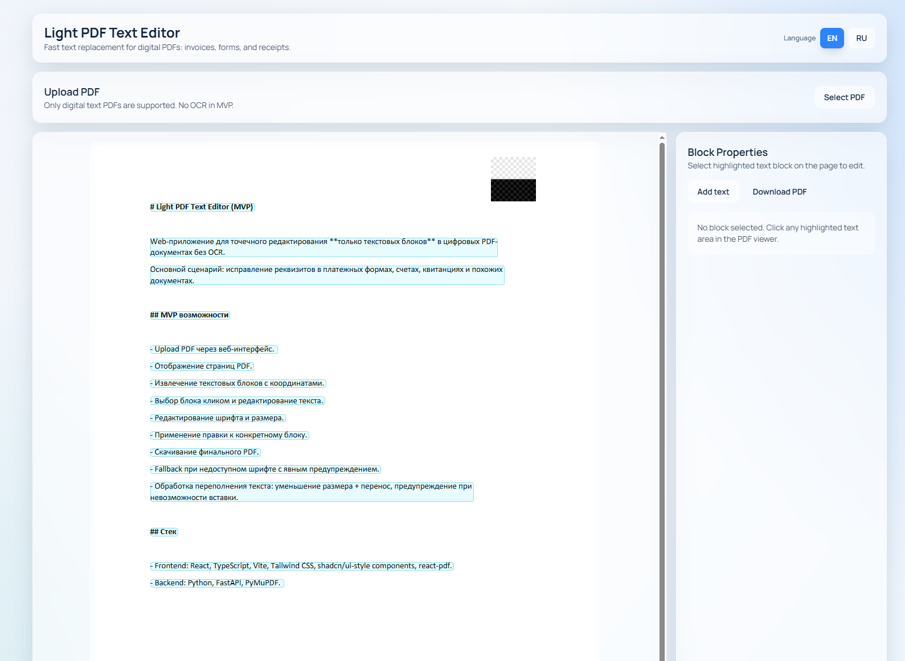

<!-- README.ru.md -->
# Light PDF Text Editor (MVP)

Веб-приложение для редактирования **только текстовых блоков** в цифровых PDF без OCR.
Основной кейс: правки реквизитов в счетах, квитанциях, платежных формах и других текстовых PDF.

## Скриншот приложения



> Путь для скриншота: `docs/app-screenshot.png`

## Что умеет MVP

- Загрузка PDF через UI.
- Просмотр страниц PDF в браузере.
- Извлечение текстовых блоков с координатами.
- Выбор блока кликом.
- Изменение текста, шрифта, размера, жирности.
- Частичная жирность через разметку `**текст**`.
- Редактирование текста прямо в области блока на превью.
- Перетаскивание и resize блока (угловые хэндлы + scale кнопки).
- Добавление нового текстового блока (`Add text`).
- Удаление существующего блока (`Delete block`).
- Применение изменений без дублей старого текста (redaction + вставка).
- Fallback шрифтов при недоступном исходном шрифте.
- Проверка переполнения и авто-подбор размера/расширение области при необходимости.
- Скачивание итогового PDF.

## Технологический стек

- Frontend: React, TypeScript, Vite, Tailwind CSS, shadcn/ui-style компоненты, react-pdf.
- Backend: Python, FastAPI, PyMuPDF.

## Разворачивание локально

### 1. Backend

```bash
cd /root/project/light-pdf/backend
python3 -m venv .venv
source .venv/bin/activate
pip install -r requirements.txt
cp .env.example .env
uvicorn app.main:app --reload --port 8000
```

Backend: `http://127.0.0.1:8000`

### 2. Frontend

```bash
cd /root/project/light-pdf/frontend
npm install
npm run dev
```

Frontend: `http://127.0.0.1:5173`

## Swagger / API docs

- Swagger UI: `http://127.0.0.1:8000/swagger`
- ReDoc: `http://127.0.0.1:8000/redoc`
- OpenAPI JSON: `http://127.0.0.1:8000/openapi.json`

## Переменные окружения

`backend/.env`:

```env
APP_NAME=Light PDF API
API_PREFIX=/api
CORS_ORIGINS=http://localhost:5173
```

## API endpoints

- `POST /api/pdf/upload` — загрузка PDF.
- `GET /api/pdf/{document_id}/blocks` — извлеченные текстовые блоки.
- `POST /api/pdf/{document_id}/apply` — применить изменение/добавление текста.
- `POST /api/pdf/{document_id}/delete` — удалить текст в области блока.
- `GET /api/pdf/{document_id}/preview` — текущая версия PDF для просмотра.
- `GET /api/pdf/{document_id}/download` — скачать финальный PDF.

## Ограничения MVP

- Только цифровые PDF (извлекаемый текст).
- OCR и сканы не поддерживаются.
- Не редактируются изображения и сложные графические объекты.
- Это не универсальный Acrobat-редактор.

## Roadmap

1. История изменений и undo/redo.
2. Режим «ластик» (удаление по клику на странице).
3. Пакетные правки нескольких блоков.
4. Более точный предпросмотр коллизий при расширении блока.
5. Импорт пользовательских шрифтов с безопасной валидацией.
